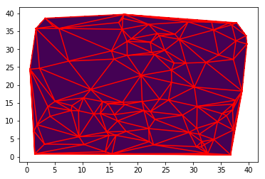
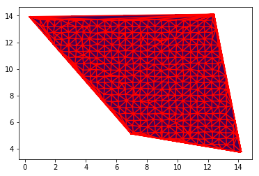

# Génération Automatique de Maillage

Projet sur la génération automatique de Maillage  
  
Pour mieux comprendre le projet et les algorithmes mis en place : voir le rapport et les ressources à disposition.  
  
## Exemples de maillage pour un nuage de points  

